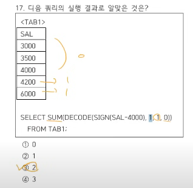
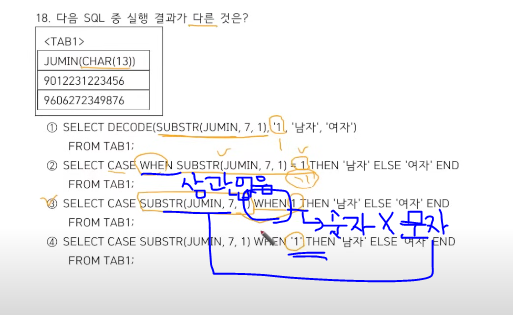
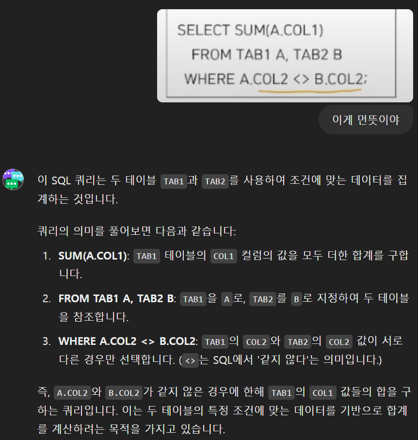
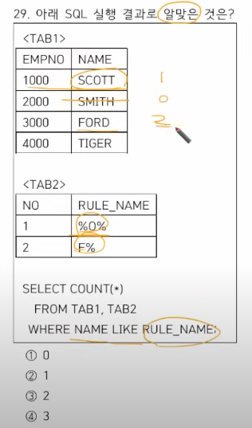
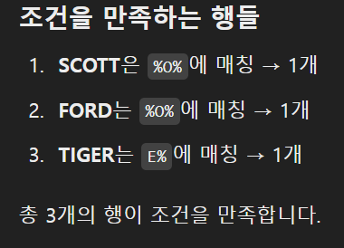
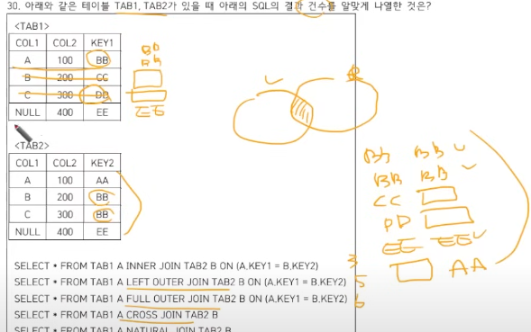

## 2. 엔터티
- 업무를 반영한 독립적인 객체
- 객체는 물리단계로 되면 테이블로 설계가 되고, 논리단계에서는 엔터티라고 표현함 
- 테이블은 행과 열로 구성되어있는데 , 논리적 단계에서는 인스턴스라고 표현하고, 컬럼들을 속성이라고 표현함
- 보통 다른 속성들은 주식별자에 의해 결정이 되기 때문에 , B가 주식별자에 의해 함수종속성을 갖는다고 해야 마즘
 
## 3. 속성의 특성에 따른 분류가 아닌것은!
1. 기본속성
2. 파생속성
3. 설계속성

-> 일반방식 : 은 속성의 구성방식에 따른 분류(PK, FK, 일반)

## 4. ERD
- 일대다의 관계 즉, 한명의 고객이 여러 서비스구매가 가능
- 한 고객이 꼭 서비스를 구매하지 않아도 됨
- 서비스 고객이 있다면 반드시 고객이 정의가 되어야 한다.
- 서비스 구매가 일어났다면 반드시 서비스는 존재할 수 밖에 없다.


## 5. 식별자의 특징
- 사원번호 라고 하는 주식별자는 NULL 이 들어갈 수없다.
    => 존재성!!
- 유일성 : 주식별자에 의해 모든 인스턴스가 유일하게 구분되어야한다.
- 너무 많은 컬럼들이 아니라 최소한의 컬럼들로만 속성들로만 구성이 되어있어야함 = 최소성
- 주식별자는 바뀌면 안된다. = 불변성 

## 6.  3차 정규화 => 이행적 종석을 없애는 단계


## 7.  개인회원 또는 법인회원 둘 중 하나로 주문 가능할 경우 고객과 주문 엔터티는 ***상호배타적!!!!!*** 관계이다.
상호포함적 NO!!

## 8. 트랜잭션
- 하나의 연속적인 업무 단위를 말함
- 트랜잭션에 의한 관계는 필수적인 관계 형태를 가짐
- 하나의 트랜잭션에는 하나 이상의 SQL 문장이 포함
- 트랜잭션의 특징
    1. 원자성 : 트랜잭션 정의된 연산들 모두 성공적으로 실행되던지 아니면 전혀 실행되지 않는 상태로 남아 있어야 함
    2. 일관성 : 트랜잭션 실행 전 데이터베이스 내용이 잘못되어 있지 않다면 트랜잭션 실행 이후에도 데이터베이스 내용이 잘못이 있으면 안됨
    3. 고립성 : 트랜잭션 실행도중 다른 트랜잭션의 영향을 받아 잘못된 결과를 만들어서는 안됨
    4. 지속성 : 트랜잭션이 성공적으로 수행되면 갱신한 데이터베이스 내용이 영구적으로 저장.

## 9.  NULL 
- NULL 로만 구성된 집합을 COUNT 하면 0으로 나옴.!! 

## 10.  식별자
- 엔터티 내의 여러 인스턴스 중 하나를 유일하게 구분할 수 있으나, 대표성을 가지지 못하는 식별자
=> 주식별자 반대: 보조식별자
- 인조식별자의 반대는 본질식별자
- 복합의 반대는 단일식별자

---
---
## 2과목

## 11.  SELECT 문
- 1. 오라클에서는 GROUP BY 절 위에 HAVING 절을 명시할 수 있다. => 가능은 하지만 가급적 GROUP BY 밑에 HAVING 절을 넣는 것을 권장
- 2.
- 3. FROM 절은 모든 DBMS 에서 생략 절대 불가능!!!!!!!
- 4. SELECT 절에 DISTINCT 는 항상 SELECT 바로 뒤에 위치한다.!@@@!!!!!!

## 12. SQL의 종류와 해당하는 명령어

1. DML -  데이터의 삽입INSERT, 수정UPDATE, 삭제DELETE, 병합MERGE
2. TCL - 트랜잭션 제어어, COMMIT, ROLLBACK, SAVEPOINT
3. DCL - 데이터 제어어로 객체에 대한 권한부여(GRANT) 하거나 회수(REVOKE)
4. DDL - 데이터 정의어, 데이터 구조 정의 CREATE,ALTER,DROP,TRUNCATE(데이터삭제) , AUTO COMMIT(명령어 수행하면 즉시 저장, 원복 불가)


## 13. 컬럼 별칭
컬럼 별칭은 SELECT절에서 정의를 하는데 , 순서상 SELECT절 이후에 수행되는 구문은 OREDER BY 절이 유일하다. 따라서 SELECT 과거에 수행된 절에서는 컬럼 별칭을 수행할 수 없으므로, WHERE절에서는 사용불가능  


## 14. 함수 실행 결과
    1. SUBSTR = 문자열 추출 결과 함수
    2. LPAD = 삽입(왼쪽에 삽입) 
- EX. LPAD('X', 5, 'X') 는 첫번째 'X' 즉 원본에다가, 맨 마지막 'X'를 삽입해서 총 5글자를 만드는것 @@!!@@ 5개 넣는거 아님1`!@~!~!~!~!~!!!!
3. INSTR = 문자열의 위치를 찾는 함수
- EX. INSTR('WWW.HDATALAB.CO.KR','.',5,2) : 16
    -> . 을 찾는데 다섯번째 글자부터 찾아서 2번째 발견된 . 의 위치
4. LIRIM : 왼쪽에서 제거하는것 근데 제거를 계속 하다가 제거하면 안되는 문자열을 만나면 즉시 제거 종료됨


## 15. 👀 자주 출제 ) 함수의 실행결과
1. CEIL(3.5) : 4 = > 천장, 3.5 보다 큰애중에 가장 가까운 정수
2. FLOOR(3.5) : 3 => 바닥, 3.5 보다 작은 애중에 가장 가까운 정수
3. ROUND(12345.678, -2):12300 => 반올림인디, -2 가 나오면 일의자리-> 십의자리 에서 반올림 하는거~!~!~!~
4. SIGN(120) :1 => 양수음수를 판별하는 함수 양수면 1 음수면 -1 0이면 0


## 16. NULL 치환함수
1. `NVL` 과 `ISNULL` 은 NVL(COMM, 100) 일 때 COMM값이 NULL이면 100을 NULL이 아니면 원래 값을 리턴해준다.
2. `COALESCE` 은 인수가 여러값이 들어올수있는데 NULL이 아닌 가장 앞에 있는 값을 리턴하는 함수이다. 즉, COMM 이 NULL이 아니면 100, 두번째 인수값이 NULL이면 세번째 인수값 리턴 ~~~ 이런식으로 작동됨
3. `NULLIF` 는 두 값이 같냐 안같냐는 판단하는 함수 즉 COMM = 100 인지 판별한다.같지 않을 때는 첫번째값 리턴, 같으면 NULL 


## 17. DECODE
- `DECODE` 는 대소를 비교하지 못함. 첫번째 인수의 값이 두번째 인수의 값과 같으면이라는 조건을 쓰는데 대소를 비교하고 싶으면 `SIGN` 함수를 쓰면 됨  

=> SIGN(SAL-4000) => SAL에서 -4000 한 값이 양수냐 음수냐?
-> 저 문제에서는 DECODE 결과값이 같으면 1, 다르면 0을 반환

## 18. CASE WHEN

CASE 구문일때는 WHEN 이 앞에 올때는 묵시적 형변환이 일어나서 상관없지만
뒤쪽에 올 경우 반드시 타입을 일치시켜줘야한다.

## 19. TO_DATE
????????????????????????????????????????????????????

## 20. COUNT
- COUNT 로 10번인 애들만 셀때는 ELSE 를 부여하면 안됨.
- ELSE를 생략하게 되면 NULL 이 치환이 됨 => NULL은 COUNT 가 세지 않기 때문에 딱 그 대상만 카운트할 수 있음
- SUM 에는 ELSE 를 생략하게 되면 NULL 로 만 이루어져있는경우, SUM의 결과값이 NULL로 나오기 때문에 NVL을 붙여서 0으로 치환된 값을 도출하자

## 21. _ 랑 % 
- %A% => A가 포함되기만 하면 됨
- 단, OR 조건은 둘 다 만족하는 애들은 빼줘야함. 3ㄷㄷ4ㄷ;;ㄷ;ㄷ';;;;

## 22. 연산자 우선순위
not - and - or 

## 23. NULL 을 포함한 SUM 의 결과 ⭐⭐⭐
일단 SUM 은 NULL을 합하지 않고!!!!!!! 근데,?
1. 중요!!!! NULL 로만 구성되어 있는 SUM 은 NULL이 리턴된다.⭐⭐⭐
2. WHERE절로 COL1이 0보다 크다는 조건을 달았음 . 근데 NULL은 크다작다의 TRUE를 리턴하지않기때문에 
NULL + 100 = NULL 이다. 

## 24. GROUP BY
1. GROUP BY 절에서는 컬럼 별칭을 사용할 수 없다. -> 오직 ORDER BY 절에서만 사용할 수 있다.
2. 그룹함수 사용할수없음 왜냐면 그룹함수를 사용하기 위해서 그룹핑할수있는컬럼을 제공하는 함수이기때문
3. GROUP BY 절에 명시되지 않은 컬럼을 그룹함수 없이 SELECT 절에 사용할 수 없다. 
4. GROUP BY 절에 나열되는 컬럼순서는 중요하지 않음

## 25. NULL을 포함한 연산과정
1. WHERE절에 해당하는 값이 없으므로 공집합으로 출력되고 아무것도 출력되지않는 것에 대해 그룹바이를 하게 되도 공집합이 출력됨
2. SUM 이 NULL을 만나면 NULL 이 된다.   
4. 주의 ⭐ COUNT는 NULL을 세지 않으므로 0을 가져옴

## 26. 
1. ORDER BY 절에 1 을 쓰게 되면 SELECT 절에 쓰인 COL1 을 말하는 거다.
2. 숫자와컬럼명을 같이 사용할 수 있다. 숫자끼리 사용도 가능. 
4. SELECT 절에서 별칭을 사용했으면 ORDER BY 절에서 정의된 별칭만 사용가능하고, 테이블명을 함께 적는 것을 불가능

## 27. 정렬문제 
숫자이지만 TO_CHAR 로 인해 문자열로 쓰이고 있고
문자열은 각자리수가 작은 숫자가 작은 숫자이다. 1300 2500 300 800 ⭐⭐⭐

## 28. NULL을 포함한 NOT EQUAL 연산
일단.!! NULL을 포함했을 때는 EQUAL이든 NOT EQUAL 이든 반응하지 않음 

???????????????

## 29. 
RULE_NAME 과 같은 애를 출력해주는 문제 
첫번째행 기준으로  둘다 만족하면 첫번째행이 두개 늘어남


```SQL
-- SQL에서 특정 조건에 맞는 행의 총 개수를 계산하는 데 사용
SELECT COUNT(*) 
    FROM TAB1, TAB2
    WHERE NAME LIKE RULE_NAME
```
TAB1 과 TAB2 를 곱한 것 
예를 들어 TAB1 에 4개의 행, TAB2에 2개의 행이 있다면 결과는 4*2=8 행이 생성된다. 


## COUNT()
주의해야할점 차이점
`COUNT(*)` 은 테이블의 모든 행을 포함해서 개수를 셈 따라서 NULL도 포함함!!!!

근데

`COUNT(컬럼명)` 은 특정 열의 값이 `NULL` 이 아닌 것만 셈 따라서 NULL포함안해!!!!!⭐

## 30. 쿼리1과 쿼리2의 키를 조인하는 문제
1. `INNER JOIN` : 값이 같은 애들 끼리 연결되는 것

BB : KEY 값 같은 것이 TAB2 에 두개가 있다면 TAB1에는 2개가 반영되어야 한다.

CC,DD : 만족되는게 없으므로 생략

EE : 한건

2. `LEFT OUTHER JOIN` : 만족되는게 없으면 그것들은 NULL로 표현하겠다. 따라서 기존에 생략되어있던 것들이 NULL값을 살아나서 5개가 된다.

3. `FULL OUTER JOIN` : `LEFT OUTER JOIN` 과 `RIGHT OUTER JOIN` 을 합친 것


4. `CROSS JOIN` : NULL값과는 상관없이 건수 X 건수 해주면 됨

5. `NATURAL JOIN` : 컬럼의 이름이 같은 것끼리 JOIN 되는 것
=> 여기서 주의할 점은!!! NULL 은 NULL 과 같다고 보지 않음!!! ⭐

## 31. 자주출제되는 문제 ⭐⭐
1. IN 연산자는 (V1 = 'A') OR (V1 = NULL) OR (V1= 'B') 이므로 
여기서 V1 = NULL은 성립되지 않는 문구 이므로 (V1 = 'A')와 (V1= 'B') 만 출력된다.

2. NOT IN 연산자는 위의 식에서 NOT 을 붙인 NOT {(V1 = 'A') AND (V1 = NULL) AND (V1= 'B')}
이므로 (OR 도 AND 로 바뀜) V1 = NULL 이 애초에 거짓이므로 전체거짓으로 판단 아무것도 출력되지 않는다.

3. EXISTS 는 TAB 을 읽어서 서브커리의 조건이 참이면 나오고 거짓이면 생략됨

4. NOT EXISTS 는 참이면 생략, 거짓이면 출력되어야함!!!! 

## 32. 
2020/02 즉 일이 생략된거는 달의 첫째날이 생략된거임

## 33. 
2번 - TAB2 B를 알지못함
3. JOIN 조건에 해당되는 컬럼명이 같다면 USING 을 쓰고 꼭!괄호! 쓰고 컬럼명만 단독으로 사용해주면됨, 조건 들어갈 수 없고, 별칭 사용 불가

## 36. 집합연산자
1. 집합연산자에서 주의해야할 점 => 컬럼의 데이터 타입이 일치해야한다. `⭐
2. 
3. 두개의 SELECT 문에서 ORDER BY 가 위쪽에 있을때는 에러가 발생할 수잇지만
맨 마지막에 있을 때는 전체커리문에 해당하는 ORDER BY문이므로 실행된다.!
4. 

## 37. 쿼리문
1. `ROLL UP` 을 하게 되면 순서가 중요한데, `DNAME` 단톡 GROUP BY 결과랑 `DNAEM` 과 `JOB` 둘 다 GROUP BY 에 넣었을 때의 결과, 그리고 GROUP BY를 전체를 했을 때의 결과가 나온다. 

=> ROLLUP(A, B)는 A별, (A, B)별, 전체 그룹 연산 결과가 출력, CUBE(A, B)는 A별, B별, (A, B)별, 전체 그룹 연산 결과 
출력 GROUPING SET은 나열한 것만 출력된다.

## 38. 
1. `SUM(주문금액) OVER (ORDER BY 일자)` 
    - `일자` 를 기준으로 `누적 합계` 를 계산하겠다! 
    근데 여기서 2024.01.02 와 같이 같은 날짜는 미리 합계를 계산해두고 하나로 본다. 
    따라서 누적합은 

2. `DENSE_RANK() OVER (PARTITION BY 지점 ORDER BY 주문금액)`
    - `지점` 별로 그룹화한 다음, `주문금액`을 기준으로 순위를 매긴다. 
    - 동일한 금액은 동일한순위를 가지며, 다음 순위로 바로 넘어감 => `DENSE_RANK`의 특징
    => DENSE_RANK()는 기본적으로 **오름차순(ASC)**으로 정렬합니다.
    => ORDER BY 절에서 정렬 기준을 명시하지 않으면, 가장 작은 값이 1위가 됩니다

## 39. FIRST_VALUE, LAST_VALUE
- FIRST_VALUE, LAST_VALUE - 정렬 순서대로 정해진 범위에서의 처음 값, 마지막 값 출력 - 순서와 범위 정의에 따라 최솟값과 최댓값 리턴 가능 - PARTITION BY, ORDER BY절 생략 가능

- FIRST_VALUE 는 대체적으로 최솟값이 나오지만 LAST_VALUE 는 최댓값이 나오지않음⭐

- PARTITION BY ~~ ORDER BY~~ 만 나왕있으면 RANGE 가 선택되면서 처음부터 현재행 까지만 연산범위가 된다.1!!!!!!

- 

## 40. 
1. 성적이 높은 순서대로 해서 무조건 세명을 뽑아야함
2. 성적이 높은 순서대로 `WITH TIES` 하면 동순위는 묶어서 같이 출력됨
3. RANK 공동2등이니까 
4. ROWNUM 이 ORDER BY보다 먼저 정해졌음 입력된 순서대로 1,2,3,4 EHOtDMA


## 41. 
계층형 질의 가상 컬럼 
1) LEVEL : 각 DEPTH를 표현(시작점부터 1) 
2) CONNECT_BY_ISLEAF : LEAF NODE(최하위노드) 여부(참:1, 거짓:0) 
※ 계층형 질의 가상 함수 
1) CONNECT_BY_ROOT 컬럼명 : 루트노드의 해당하는 컬럼값 
2) SYS_CONNECT_BY_PATH(컬럼, 구분자) : 이어지는 경로 출력 
3) ORDER SIBLINGS BY 컬럼 : 같은 LEVEL일 경우 정렬 수행 
4) CONNECT_BY_ISCYCLE : 계층형 쿼리의 결과에서 순환이 발생했는지 여부 

## 42. 계층형 질의절
사원번호를 먼저 읽고 매니저사원번호가 1000번인 애들을 읽는다. 
나사장은 무조건 출력되어야함 CONNECT BY는 나사장으로 부터 연결된 애들을 출력하는 거기 때문에 

ORDER SIBLINGS BY => 그리고 같은 레벨일 때 이름을 정렬하겠다.


## 43. PIVOT
롱데이터를 와이드하게 하겠다. 
???????????????????????????


## 44. 정규식 표현식
COUNT 를 하ㅡㄴ 거다. 숫자가 2개 이상 
숫자 콤마를 쓰면 2회이상. 

## 45. 정규식 표현식

WERHE REGEXP_LIKE => 이 조건에 해당하는 애들만 뽑겠다.
[] 로 쓰였을 때는 또는 으로 접근하여 [XY-] 일 때 X 또는 Y또는 -이면 됨

`?` 는 있어도 좋고 없어도 좋고 라는 의미라 `Z?` 는 Z 가 있어도 좋고 없어도 됨


## 46. 서브쿼리를 사용한 UPDATE

## 47. ROLLBACK은 취소 , 돌아가는것
첫 INSERT문장은 COMMIT했기 때문에 영구 저장된다. 그 이후 UPDATE, INSERT, DELETE를 차례대로 하지만 
SAVE1 지점으로 롤백하므로 INSERT와 DELETE는 실행 취소된다. 첫 UPDATE문장과 마지막 UPDATE문장은 모두 
롤백되어 결과적으로는 첫 INSERT문장만 실행된다. 따라서 남은 행의 SUM(COL2) 결과는 11이다.

## 48. VARCHAR
문자비교할때는 왼쪽부터 비교하고 길이가 더 큰애를 더 크다고 판단.

## 49. 
NUMBER(5,2) 총 5개의 숫자중에 소수점자리 2개는 쓰겠다는 의미
그래서 정수자리에는 3자가 들어오고 소수점자리는 2개보다 큰수가 들어가도 알아서 무시되기 때문에 2개로 인식됨 

## 50. 유저, 권한


